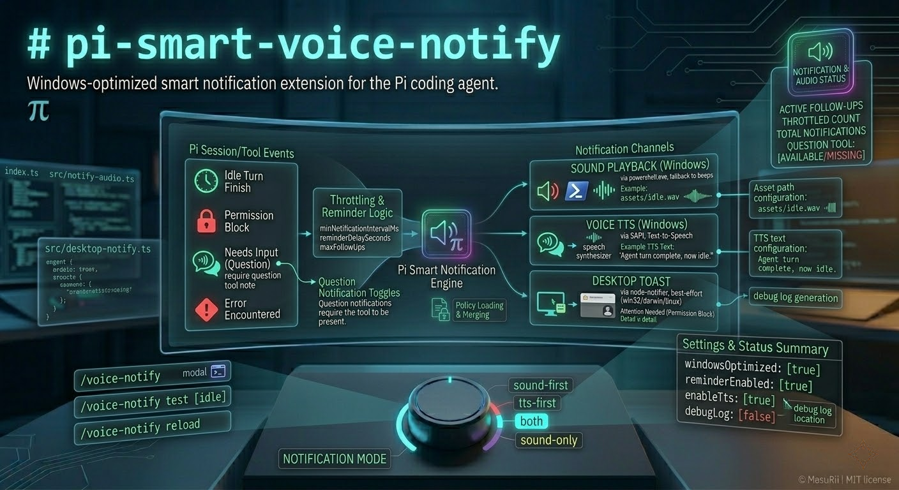

# pi-smart-voice-notify

Windows-optimized smart notification extension for the Pi coding agent.

`pi-smart-voice-notify` watches Pi session/tool events and can alert you via **Windows SAPI TTS**, **sound playback**, and/or **desktop toast notifications** when the agent:

- finishes a turn (idle)
- hits a permission block
- needs your input (question)
- encounters an error



## Features

- Multi-channel notifications:
  - **Sound** (Windows via `powershell.exe` playback; falls back to simple beeps if playback fails)
  - **Voice** (Windows SAPI text-to-speech)
  - **Desktop notifications** via `node-notifier` (win32/darwin/linux best-effort)
- Reminder + follow-up scheduling when attention is still needed
- Throttling to avoid notification spam (`minNotificationIntervalMs`)
- Interactive settings UI:
  - `/voice-notify` opens a configuration modal in interactive mode
  - hides question-related settings automatically when no custom `question` tool is available
- Optional debug logging to `debug/` for diagnosing platform / PowerShell / notifier issues

## Installation

### Local extension folder

Place this folder in either:

- Global: `~/.pi/agent/extensions/pi-smart-voice-notify`
- Project: `.pi/extensions/pi-smart-voice-notify`

Pi auto-discovers these locations.

### As an npm package

```bash
pi install npm:pi-smart-voice-notify
```

Or from git:

```bash
pi install git:github.com/MasuRii/pi-smart-voice-notify
```

## Configuration

Runtime config is stored at:

```text
~/.pi/agent/extensions/pi-smart-voice-notify/config.json
```

A starter template is included as:

```text
config/config.example.json
```

On startup the extension:

- creates `config.json` with defaults if missing
- normalizes/clamps values on load **and writes the normalized config back to disk**

### Common settings

- `enabled` (boolean): master on/off switch
- `windowsOptimized` (boolean): when `true`, shows a one-time warning on non-Windows platforms that audio behavior is best-effort
- `notificationMode`:
  - `sound-first` (default)
  - `tts-first`
  - `both`
  - `sound-only`
- Channel toggles:
  - `enableSound` (Windows)
  - `enableTts` (Windows)
  - `enableDesktopNotification` (toast via `node-notifier`)
- Per-event toggles:
  - `enableIdleNotification`
  - `enablePermissionNotification`
  - `enableQuestionNotification` (only effective when a custom tool named `question` is loaded)
  - `enableErrorNotification`
- Reminder / follow-ups:
  - `reminderEnabled`, `reminderDelaySeconds`
  - `followUpEnabled`, `maxFollowUps`, `followUpBackoffMultiplier`
- Debug:
  - `debugLog` (boolean): writes JSONL debug events to the debug log file

### Sound file paths

Sound fields (`idleSoundFile`, `permissionSoundFile`, `questionSoundFile`, `errorSoundFile`) may be:

- **absolute paths**, or
- **paths relative to the extension directory** (`~/.pi/agent/extensions/pi-smart-voice-notify/`)

The default template uses paths under `assets/`.

## Usage / Commands

Command name:

```text
/voice-notify
```

- With **no arguments**:
  - in interactive mode: opens the settings modal
  - in non-interactive mode: prints a config summary (the UI is required for the modal)

Subcommands:

```text
/voice-notify status
/voice-notify reload
/voice-notify on
/voice-notify off
/voice-notify test [idle|permission|question|error]
```

Behavior notes:

- `/voice-notify reload` re-reads `config.json` and resets reminder state.
- `/voice-notify test ...` bypasses throttling so you can validate your setup quickly.
- If no custom `question` tool is loaded, question notifications are skipped and `/voice-notify test question` warns.

## Notes (assets & debug)

- Notification sound assets live in: `assets/`
- When `debugLog: true`, debug logs are written under:
  - directory: `~/.pi/agent/extensions/pi-smart-voice-notify/debug/`
  - file: `~/.pi/agent/extensions/pi-smart-voice-notify/debug/pi-smart-voice-notify.log`

## Troubleshooting

### I ran `/voice-notify` but no modal appeared

- The settings modal requires **interactive UI mode** (`ctx.hasUI`).
- In non-interactive contexts, `/voice-notify` prints a summary instead.

### Desktop notifications are not showing

- Ensure `enableDesktopNotification` is `true`.
- This extension uses `node-notifier`. If the underlying platform backend is unavailable, notifications may fail.
- Turn on `debugLog` and inspect `debug/pi-smart-voice-notify.log` for `desktop.notify.failed` events.

### No sound / no voice on Windows

- Sound + SAPI TTS are Windows-only features (`process.platform === "win32"`).
- The extension invokes `powershell.exe` for sound playback and TTS. If PowerShell is restricted/unavailable, audio will fail.
- Turn on `debugLog` and search the log for `powershell.exec` entries.

### Question notifications never trigger

- Question notifications are only enabled when Pi has a custom tool named `question` loaded.
- Run `/voice-notify status` and check `questionToolAvailable=true/false`.

## Development

```bash
npm install
npm run build
npm run lint
npm run test
npm run check
```

Project requirements:

- Node.js `>= 20` (see `package.json`)

## Project Layout

- `index.ts` - root extension entrypoint (kept for Pi auto-discovery)
- `src/index.ts` - extension bootstrap, event hooks, `/voice-notify` command
- `src/config-store.ts` - config paths, normalization, load/save, debug log path constants
- `src/notify-audio.ts` - Windows sound + SAPI TTS + monitor wake best-effort helpers
- `src/desktop-notify.ts` - toast notifications via `node-notifier`
- `config/config.example.json` - starter config template
- `assets/` - bundled sound assets referenced by default config
- `debug/` - created at runtime when debug logging is enabled

## License

MIT
